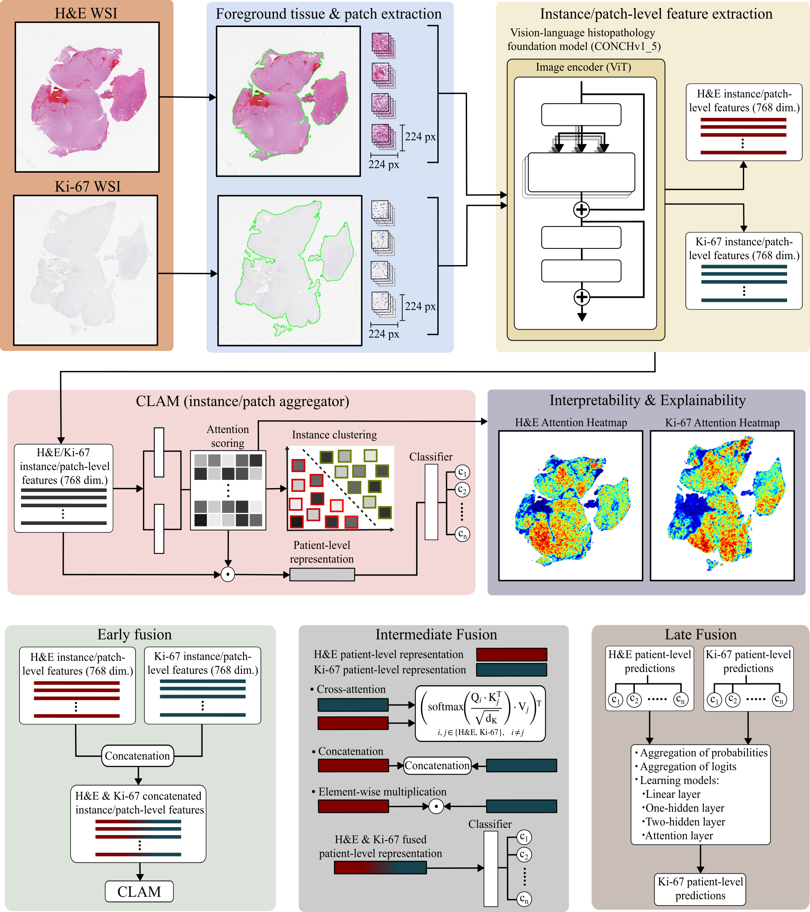
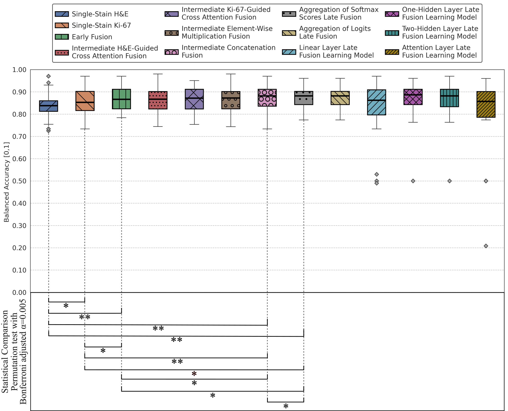
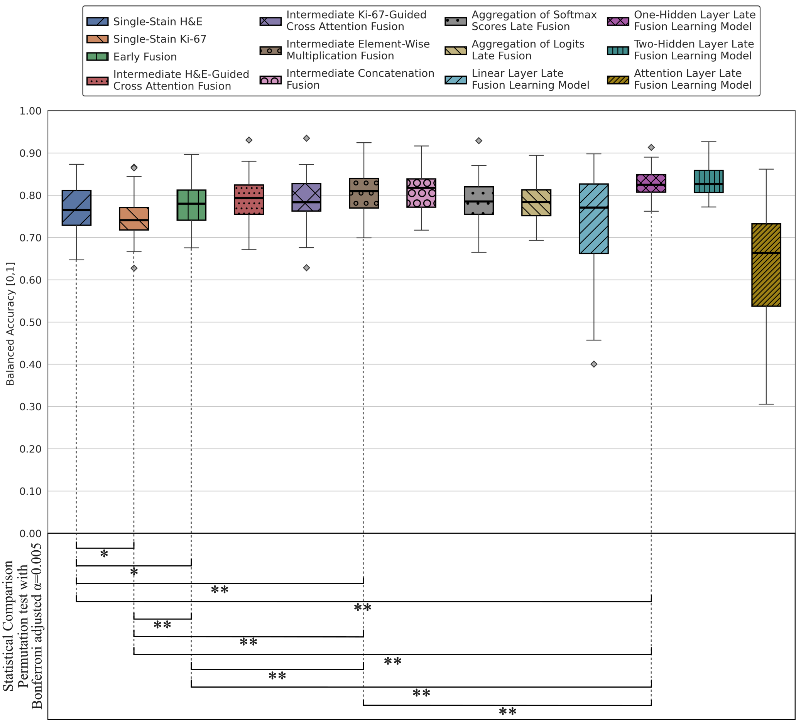

# Multi-Stain Fusion of Histopathology Images Using Deep Learning for Pediatric Brain Tumor Classification

This repository contains the code for the pre-processing, model training and evaluation for the classification of
pediatric WSI brain tumors from the [Children's Brain Tumor Network](https://cbtn.org) dataset. The weights for the
CONCHv1\_5 pre-trained model and the original code for CLAM  are available at [Hugging
Face](https://huggingface.co/MahmoodLab/conchv1_5) and https://github.com/mahmoodlab/clam, respectively.

[BioRxiv](https://www.biorxiv.org/content/10.64898/2026.04.10.717785v1.abstract) | [Cite](#reference)

## Abstract   
The classification of pediatric brain tumors is investigated using deep learning on hematoxylin and eosin (H&E) and
antigen Ki-67 (Ki-67) whole slide images (WSIs) from the Children’s Brain Tumor Network (CBTN) dataset. A total of 1,662
unregistered WSIs (1,047 H&E and 615 Ki-67 images) were analyzed, including low-grade glioma/astrocytoma (grades 1, 2)
(LGG), high-grade glioma/astrocytoma (grades 3, 4) (HGG), medulloblastoma (MB), ependymoma (EP) and ganglioglioma. The
The aim of this study was to effectively classify pediatric brain tumors using H&E and Ki-67 WSIs individually, and to
investigate whether early, intermediate, and late fusion could improve the predictive performance. From each WSI, 224×
224 pixel patches were extracted, and the instance (patch)-level features were obtained using the histology foundation
model CONCHv1_5. The instances were aggregated using clustering-constrained attention multiple instance learning (CLAM)
for patient-level classification. Model interpretability and explainability was assessed through attention heatmaps,
cell density and Ki-67 labelling index (LI) maps. In the binary grade classification between LGG and HGG, the
intermediate concatenation fusion achieved the best performance with a balanced accuracy of 0.88 ± 0.05, (p < 0.005)
compared to the single-stain models (H&E: 0.84 ± 0.05, Ki-67: 0.86 ± 0.05). For the 5-class tumor type classification,
the one-hidden layer late fusion learning model achieved the highest balanced accuracy of 0.83 ± 0.04 (p < 0.005),
outperforming the single-stain models (H&E: 0.77 ± 0.05, Ki-67: 0.74 ± 0.05). Overall, most of the fusion approaches
outperformed the single-stain models in both classification tasks (p < 0.005). The Ki-67 attention maps demonstrated
moderate to strong Spearman correlation (ρ = 0.576 − 0.823) with the cell density and Ki-67 LI maps, suggesting that
these features are associated with the model’s predictions, although additional features may contribute. The results
show that H&E and Ki-67 images provide complementary information, and most of the multi-stain fusion approaches using
deep learning improve pediatric brain tumor diagnosis.

## Key Highlights
The key highlights of this work are:
- Application of state-of-the-art deep learning frameworks in computational pathology for pediatric brain tumor WSI classification.
- Single-stain models achieved a balanced accuracy of 0.84 ± 0.05 (H&E) and 0.86 ± 0.05 (Ki-67) for glioma grading, and
  0.77 ± 0.05 (H&E) and 0.74 ± 0.05 (Ki-67) for five-class tumor typing.
- Fusion of H&E and Ki-67 WSIs improved the predictive performance of pediatric brain tumor type classification.
- Intermediate fusion achieved a balanced accuracy of 0.88 ± 0.05 for glioma grading.
- Late fusion achieved a balanced accuracy of 0.83 ± 0.04 for five-class tumor typing.
- Ki-67 attention heatmaps correlate with cell density maps (and potentially other histological features), improving the interpretability and explainability of deep learning models in computational pathology.



# Results



<strong>Figure:</strong> Boxplots summarizing balanced accuracy for LGG versus HGG classification on the test sets,
computed across 50 non-parametric bootstrap replicates. Statistical comparisons are performed using a two-sided
permutation test at a significance level of $\alpha = 0.05$ between the single-stain models, early fusion,
best-performing intermediate fusion (concatenation), and the best-performing late fusion (aggregation of softmax
scores). Double asterisks ( ** ) indicate statistically significant differences after Bonferroni correction, with an
adjusted significance level of $\alpha = 0.05/10 = 0.005$.

<strong>Table:</strong> Binary grade classification performance between LGG and HGG on the test sets. Metrics are
reported as mean ± standard deviation with 95% confidence intervals (CI) shown in brackets, computed across 50
replicates of non-parametric bootstrapping. The best performing approach and metrics are highlighted in
<ins><strong>bold and underlined</strong></ins>.

| Model | Balanced Accuracy | MCC | AUC-ROC | Weighted F1-score |
|---|---|---|---|---|
| Single-Stain H&E | 0.84 ± 0.05 [0.82, 0.85] | 0.70 ± 0.09 [0.67, 0.72] | 0.91 ± 0.04 [0.90, 0.92] | 0.88 ± 0.03 [0.87, 0.89] |
| Single-Stain Ki-67 | 0.86 ± 0.05 [0.84, 0.87] | 0.74 ± 0.09 [0.72, 0.77] | 0.92 ± 0.05 [0.91, 0.93] | 0.90 ± 0.03 [0.89, 0.91] |
| Early Fusion | 0.87 ± 0.05 [0.86, 0.88] | 0.76 ± 0.08 [0.73, 0.78] | <ins><strong>0.94 ± 0.04 [0.93, 0.95]</strong></ins> | <ins><strong>0.91 ± 0.03 [0.90, 0.91]</strong></ins> |
| Intermediate H&E-Guided Cross-Attention Fusion | 0.87 ± 0.05 [0.85, 0.88] | 0.73 ± 0.09 [0.71, 0.76] | 0.92 ± 0.04 [0.91, 0.93] | 0.90 ± 0.03 [0.89, 0.91] |
| Intermediate Ki-67-Guided Cross-Attention Fusion | 0.86 ± 0.06 [0.85, 0.88] | 0.73 ± 0.09 [0.70, 0.76] | 0.92 ± 0.04 [0.91, 0.93] | 0.90 ± 0.04 [0.89, 0.91] |
| <ins><strong>Intermediate Concatenation Fusion</strong></ins> | <ins><strong>0.88 ± 0.05 [0.86, 0.89]</strong></ins> | 0.76 ± 0.09 [0.74, 0.79] | 0.92 ± 0.04 [0.91, 0.94] | <ins><strong>0.91 ± 0.03 [0.90, 0.92]</strong></ins> |
| Intermediate Element-Wise Multiplication Fusion | 0.87 ± 0.05 [0.85, 0.88] | 0.75 ± 0.09 [0.73, 0.78] | 0.93 ± 0.04 [0.92, 0.94] | <ins><strong>0.91 ± 0.03 [0.90, 0.92]</strong></ins> |
| Aggregation of Softmax Scores Late Fusion | 0.87 ± 0.05 [0.86, 0.88] | <ins><strong>0.77 ± 0.08 [0.75, 0.79]</strong></ins> | 0.93 ± 0.04 [0.92, 0.94] | <ins><strong>0.91 ± 0.03 [0.90, 0.92]</strong></ins> |
| Aggregation of Logits Late Fusion | 0.87 ± 0.05 [0.86, 0.88] | <ins><strong>0.77 ± 0.08 [0.75, 0.79]</strong></ins> | 0.93 ± 0.04 [0.92, 0.94] | <ins><strong>0.91 ± 0.03 [0.90, 0.92]</strong></ins> |
| Linear Layer Late Fusion Learning Model | 0.83 ± 0.12 [0.80, 0.86] | 0.68 ± 0.24 [0.61, 0.74] | 0.91 ± 0.08 [0.89, 0.93] | 0.88 ± 0.09 [0.85, 0.90] |
| One-Hidden Layer Late Fusion Learning Model | 0.87 ± 0.07 [0.85, 0.89] | 0.75 ± 0.14 [0.71, 0.78] | 0.92 ± 0.04 [0.91, 0.93] | 0.90 ± 0.05 [0.89, 0.92] |
| Two-Hidden Layer Late Fusion Learning Model | 0.87 ± 0.07 [0.85, 0.89] | 0.74 ± 0.14 [0.70, 0.78] | 0.92 ± 0.04 [0.91, 0.93] | 0.90 ± 0.05 [0.88, 0.91] |
| Attention Layer Late Fusion Learning Model | 0.78 ± 0.18 [0.74, 0.83] | 0.56 ± 0.34 [0.46, 0.65] | 0.88 ± 0.15 [0.84, 0.92] | 0.82 ± 0.17 [0.77, 0.86] |



<strong>Figure:</strong> Boxplots summarizing balanced accuracy for the five-class tumor type classification on the test
sets, computed across 50 non-parametric bootstrap replicates. Statistical comparisons are performed using a two-sided
permutation test at a significance level of $\alpha = 0.05$ between the single-stain models, early fusion,
best-performing intermediate fusion (element-wise multiplication), and the best-performing late fusion (one hidden layer
learning model). Double asterisks ( ** ) indicate statistically significant differences after Bonferroni correction,
with an adjusted significance level of $\alpha = 0.05/10 = 0.005$.

<strong>Table:</strong> Classification performance between 5 tumor types on the test sets. Metrics are reported as mean
± standard deviation with 95% confidence intervals (CI) shown in brackets, computed across 50 replicates of
non-parametric bootstrapping. The best performing approach and metrics are highlighted in <ins><strong>bold and
underlined</strong></ins>.

| Model | Balanced Accuracy | MCC | AUC-ROC | Weighted F1-score |
|---|---|---|---|---|
| Single-Stain H&E | 0.77 ± 0.05 [0.75, 0.78] | 0.74 ± 0.05 [0.73, 0.75] | 0.94 ± 0.02 [0.94, 0.95] | 0.81 ± 0.04 [0.80, 0.82] |
| Single-Stain Ki-67 | 0.74 ± 0.05 [0.73, 0.76] | 0.71 ± 0.05 [0.70, 0.73] | 0.94 ± 0.02 [0.93, 0.94] | 0.79 ± 0.03 [0.78, 0.80] |
| Early Fusion | 0.78 ± 0.05 [0.76, 0.79] | 0.76 ± 0.04 [0.75, 0.77] | 0.95 ± 0.01 [0.95, 0.96] | 0.82 ± 0.03 [0.82, 0.83] |
| Intermediate H&E-Guided Cross-Attention Fusion | 0.79 ± 0.05 [0.77, 0.80] | 0.75 ± 0.05 [0.74, 0.77] | 0.94 ± 0.02 [0.94, 0.95] | 0.82 ± 0.04 [0.81, 0.83] |
| Intermediate Ki-67-Guided Cross-Attention Fusion | 0.79 ± 0.05 [0.77, 0.80] | 0.75 ± 0.04 [0.74, 0.76] | 0.94 ± 0.02 [0.94, 0.95] | 0.82 ± 0.03 [0.81, 0.83] |
| Intermediate Concatenation Fusion | 0.81 ± 0.04 [0.80, 0.82] | 0.78 ± 0.04 [0.77, 0.80] | 0.95 ± 0.01 [0.95, 0.96] | 0.84 ± 0.03 [0.84, 0.85] |
| Intermediate Element-Wise Multiplication Fusion | 0.81 ± 0.05 [0.79, 0.82] | <ins><strong>0.79 ± 0.05 [0.78, 0.80]</strong></ins> | <ins><strong>0.95 ± 0.02 [0.95, 0.96]</strong></ins> | <ins><strong>0.85 ± 0.03 [0.84, 0.86]</strong></ins> |
| Aggregation of Softmax Scores Late Fusion | 0.79 ± 0.05 [0.77, 0.80] | 0.77 ± 0.05 [0.76, 0.78] | 0.95 ± 0.02 [0.95, 0.96] | 0.83 ± 0.04 [0.82, 0.84] |
| Aggregation of Logits Late Fusion | 0.78 ± 0.05 [0.77, 0.80] | 0.77 ± 0.04 [0.76, 0.78] | 0.95 ± 0.02 [0.95, 0.96] | 0.83 ± 0.03 [0.82, 0.84] |
| Linear Layer Late Fusion Learning Model | 0.73 ± 0.13 [0.69, 0.76] | 0.66 ± 0.13 [0.63, 0.70] | 0.94 ± 0.03 [0.93, 0.95] | 0.73 ± 0.12 [0.69, 0.76] |
| <ins><strong>One-Hidden Layer Late Fusion Learning Model</strong></ins> | <ins><strong>0.83 ± 0.04 [0.82, 0.84]</strong></ins> | 0.77 ± 0.03 [0.76, 0.78] | <ins><strong>0.95 ± 0.01 [0.95, 0.96]</strong></ins> | 0.83 ± 0.03 [0.83, 0.84] |
| Two-Hidden Layer Late Fusion Learning Model | <ins><strong>0.83 ± 0.04 [0.82, 0.84]</strong></ins> | 0.77 ± 0.04 [0.76, 0.78] | <ins><strong>0.95 ± 0.01 [0.95, 0.96]</strong></ins> | 0.83 ± 0.03 [0.82, 0.84] |
| Attention Layer Late Fusion Learning Model | 0.63 ± 0.14 [0.59, 0.67] | 0.54 ± 0.15 [0.50, 0.59] | 0.89 ± 0.06 [0.88, 0.91] | 0.60 ± 0.16 [0.56, 0.65] |

## Acknowledgements & Funding
The research was made possible in part due to [The Children's Brain Tumor Tissue Consortium (CBTTC)/The Children's Brain Tumor Network (CBTN)](https://cbtn.org). The study was financed by Swedish Childhood Cancer Foundation
(MT2021-0011, MT2022-0013), Joanna Cocozza's Foundation (2025-2026), Linköping University's Cancer Strength Area (2024),
Medical Research Council of Southeast Sweden (FORSS-1011571). Lindblad was supported by the Swedish Cancer Society (25
4859 Pj).

## Reference
```
@article{spyretos2026multi,
  title={Multi-Stain Fusion of Histopathology Images Using Deep Learning for Pediatric Brain Tumor Classification},
  author={Spyretos, Christoforos and Tampu, Iulian Emil and Lindblad, Joakim and Haj-Hosseini, Neda},
  journal={bioRxiv},
  pages={2026--04},
  year={2026},
  publisher={Cold Spring Harbor Laboratory}
}
```